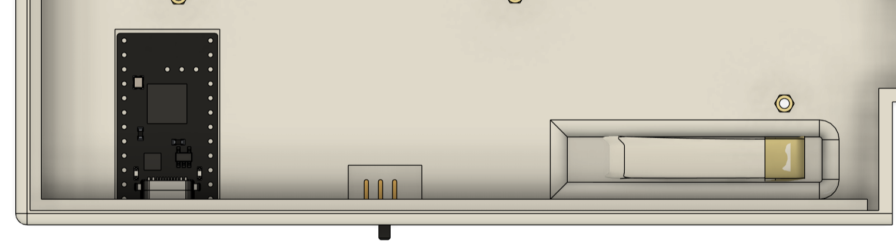
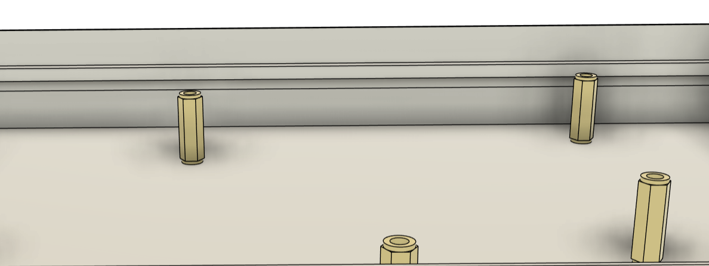
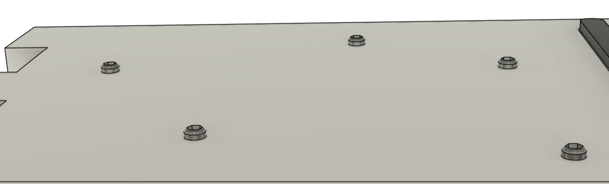
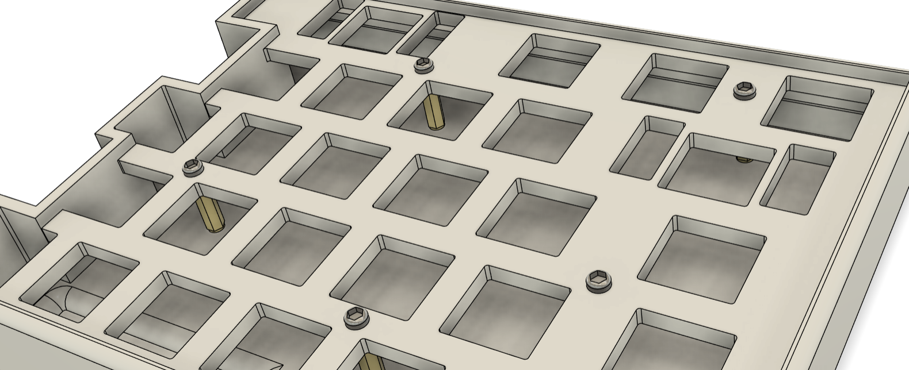

<div align="center">


---------


</div>


Cyprus is 60 % mechanical split keyboard designed by Mohammad Sarfaraz aka Sappling.

### Features:

* This keyboard is handwired so its very affordable.
* This keyboard features standard split.
* Its very compact making it very portable
* It uses magnets to connect the splits allowing fast assembly.
* It uses Nice Nano V2(or Supermini nRF52840) with 5.4 bluetooth connectivity.


## Navigation

* [Assets](./Assets/)
* [Cad file](./Cad/)
* [Firmware](./Firmware/)
* [Production](./Production/)

### Variants

There is just one variant right now. 

`Cyprus HW` : Cyprus Handwired

## BOM 
*I have only included the component which is 'specific' to my cad design*

| Part  | Quantity | price(INR) | price(USD) | link |
|-------|----------|-----|-----------|------|
| Promicro NRF52840 | 2 | 758.00 |  7.98  | [link](https://robu.in/product/promicro-nrf52840-development-board/) |
| 3.7V LiPo Battery | 2 | 139.00  | 1.46  | [link](https://robocraze.com/products/witty-fox-120mah-rechargeable-3-7v-lipo-battery?_pos=6&_sid=47fff7de1&_ss=) |
| Slide Switch | 2 | 9 | 0.095 | [link](https://robocraze.com/products/slide-switch-3-pin-2-way-spdt?_pos=1&_sid=5bdbba5e9&_ss=r) |
| Stand off | 12 | 25 | 0.26 | [link](https://quartzcomponents.com/products/m3-x-10mm-female-to-female-nickel-plated-brass-hex-threaded-pillar-standoff-spacer-pack-of-4-pc?srsltid=AfmBOoqKSATpMRCvpfYnO_aOGEayFTTyo2ozcalroCYJ79QNntu-CT_j) |
| Magnets | 1 | 275 | 2.90 | [link](https://www.amazon.in/ART-IFACT-4mm-Round-Disk/dp/B0GFWH1TSV?ref_=Oct_d_orecs_d_3591242031_3&pd_rd_w=NrsPx&content-id=amzn1.sym.53468083-cc20-4d00-bd56-23505c8eb8c3&pf_rd_p=53468083-cc20-4d00-bd56-23505c8eb8c3&pf_rd_r=7XY205BHY6D89JFAQNGF&pd_rd_wg=S8d2w&pd_rd_r=2415a8be-7972-48b4-95de-521e4a5035c5&pd_rd_i=B0GFWH1TSV) |
| M3 Screws | 12 | 1.6 | 0.02 | [link](https://onlyscrews.in/products/chhd-m3-x-6mm-pack-of-22) |
| Gateron Switches | 70 | 199 | 2.10 | [link](https://meckeys.com/shop/accessories/keyboard-accessories/key-switches/gateron-mechanical-pro-switch-5pin/?srsltid=AfmBOorgmVOZb0u9DkI4ZCt7RVFLX5Wy3gB1b4_5lnGXyiva7xzfVLfr) | 
| Keycaps(Purple) | 1 | 1299 | 13.71 | [link](https://curiositycaps.in/products/fragrance-backlit-cherry-pbt-keycap?_pos=26&_fid=34c079692&_ss=c) | 
| Keycaps(Blue) | 1 | 1299 | 13.71 | [link](https://curiositycaps.in/products/blue-gradient-side-backlit-cherry-pbt-keycaps?_pos=27&_fid=34c079692&_ss=c) |
| Diode(1N4148) | 70 | 1.54 | 0.02 | [link](https://robu.in/product/1n4148-1w-zener-diode-pack-of-50/?gad_source=1&gad_campaignid=17427802703&gbraid=0AAAAADvLFWfSfYH3b6JsF08tQy6CYGKa2&gclid=CjwKCAjw3ejRBhAdEiwADkqPn-QAkLgKUPqwyf5bGNX7XTmVxYJCNFO2ZrdXqTbUgrOG83KAMbka1RoCtHYQAvD_BwE) | 


## Firmware

*Note: Before you understand firmware, you need to have a basic understanding of [how keyboard matrix work](https://docs.qmk.fm/how_a_matrix_works).*

This project uses [ZMK firmware](https://zmk.dev/docs) to code the board. Visit the link to read the documentation for a lot more information.

I am going to explain basics that you need to understand in the firmware. 

You assign board in file named `build.yaml` i.e. : 

``` 
include: 
  - board: nice_nano_v2
    shield: Cyprus_left
  - board: nice_nano_v2
    shield: Cyprus_right 
  - board: nice_nano_v2
    shield: settings_reset

```
You assign the common rows of the split in `<keyboard_name>.dtsi` file.

```    kscan0: kscan {
        compatible = "zmk,kscan-gpio-matrix";
        wakeup-source;
        diode-direction = "col2row";
        row-gpios = <&pro_micro 4 (GPIO_ACTIVE_HIGH | GPIO_PULL_DOWN)>,
                    <&pro_micro 8 (GPIO_ACTIVE_HIGH | GPIO_PULL_DOWN)>;
    };

```

You assign column in separate .overlay files

``` &kscan0 {
    col-gpios = <&pro_micro 21 GPIO_ACTIVE_HIGH>,
                <&pro_micro 14 GPIO_ACTIVE_HIGH>;
};

```

**Keymap**

 visit https://zmk.dev/docs/keymaps/behaviors for more information.

Standard keymap -

``` 
keymap {
        compatible = "zmk,keymap";

        default_layer {
            // -----------------------------------------------------------------------------------------
            // | `   |  1  |  2  |  3  |  4  |  5  |  6  |   |  7  |  8  |  9  |  0  |  -  |  =  |     | BKSP |
            // | TAB |  Q  |  W  |  E  |  R  |  T  |     |   |  Y  |  U  |  I  |  O  |  P  |  [  |  ]  |  \   |
            // | CAPS|  A  |  S  |  D  |  F  |  G  |     |   |  H  |  J  |  K  |  L  |  ;  |  '  |     |  ENT |
            // | SHFT|     |  Z  |  X  |  C  |  V  |     |   |  B  |  N  |  M  |  ,  |  .  |  /  |     |  SHFT|
            // | CTRL| GUI | ALT |     |     |     | SPC |   | SPC |     |     |     | MO1 | ALT | GUI | CTRL |
            // -----------------------------------------------------------------------------------------
            bindings = <
              &kp GRAVE  &kp N1    &kp N2    &kp N3    &kp N4    &kp N5    &kp N6         &kp N7    &kp N8    &kp N9    &kp N0    &kp MINUS &kp EQUAL           &kp BSPC
              &kp TAB    &kp Q     &kp W     &kp E     &kp R     &kp T                    &kp Y     &kp U     &kp I     &kp O     &kp P     &kp LBKT  &kp RBKT  &kp BSLH
              &kp CLCK   &kp A     &kp S     &kp D     &kp F     &kp G                    &kp H     &kp J     &kp K     &kp L     &kp SEMI  &kp SQT             &kp RET
              &kp LSHFT            &kp Z     &kp X     &kp C     &kp V                    &kp B     &kp N     &kp M     &kp COMMA &kp DOT   &kp FSLH            &kp RSHFT
              &kp LCTRL  &kp LGUI  &kp LALT                                &kp SPACE      &kp SPACE                               &mo 1     &kp RALT  &kp RGUI  &kp RCTRL
            >;
        };};
```

### Build and Configuration

#### Prerequisites

 *  Basic Soldering skill
 *  Access to 3d Printer
 *  A hot glue gun.

#### Cad
*⚠️Important: I have not printed it myself so I do not gauranty that cad design would also work for you especially if you are choosing some commponent different than mine. That said, you would have to experiment with the cad design yourself.*

Print the [stl files](./Production/) using a 3d printer.

#### Wiring 

  First you need to wire everything up just like this schematics here. 

  

  Since I have not build it myself, I cant really show you the irl wiring photo. But if you want to know how to wire these effectively, I recommend you to watch any youtube video related to making handwire keyboard.


#### Build and Assembly

1. Assemble your switches on the plate of the keybaord, like this : 


2. Then do the [wiring](#wiring). However, dont connect the battery just yet.

6. Then connect your MCU board to your Laptop(or System) to compile and flash the [firmware](./firmware/). Make sure that you coose the right file respective of each split.

7. Then make sure that switch is off, and connect the batteries up like in the [wiring](#wiring) diagram. Again make sure that every connection is okay and then switch ON.

3. Then bring both mcu board as close as possible and then press the reset button on both of them at the same time. It would connect them via bluetooth.

3. then after switching OFF the slide switch, carefully place the MCU board, battery and slide switch like this: 



you have to be carefull because you would have already connected wires at this point, so make sure every connection is okay and no wires is tangled.

Then use hot glue to secure them in place.

4. Then place the stand offs on the case and secure it with screws from botton side of the board , like this : 





8. Then place the assembled plate on the case such that the hole made for screws aligh with the hole in the stand offs and then screw it up from top through the plate into stand offs.



9. Then, place the magnet and secure it with hotglue. Just dont over use the glue.

10. Finally, its ready.

*Note: If you need to access the reset and bootloader buttom of your mcu in the future, you can do it with the asigned bootloader and reset switch on the keyboard.*

#### Compile and Flash(Specifics)

Now, you could follow the official method by zmk if you want to add your own personal touch to the firmware of your keyboard.

If you just want to use the pre-compiled firmware:

1. Connect the MCU of your **Left** half to your computer via USB.
2. Enter bootloader mode (usually by double-tapping the reset button). A new USB mass storage drive (e.g., `NICENANO`) should appear on your computer.
3. Copy the compiled left half `.uf2` file into this drive. The drive will automatically disconnect once the flashing is complete.
4. Repeat the same process for the **Right** half with the right half `.uf2` file.

### Poster


-------------

### LICENSE

Creative Commons Attribution-NonCommercial 4.0 International (CC BY-NC 4.0)

---

You are free to:

- **Share** — copy and redistribute the material in any medium or format
- **Adapt** — remix, transform, and build upon the material

The licensor cannot revoke these freedoms as long as you follow the license terms.

---

Under the following terms:

- **Attribution** — You must give appropriate credit, provide a link to the license, and indicate if changes were made.
- **NonCommercial** — You may not use the material for commercial purposes.
- **No additional restrictions** — You may not apply legal terms or technological measures that legally restrict others from doing anything the license permits.


No warranties are given. For more details, see the [full license](https://creativecommons.org/licenses/by-nc/4.0/).

----

**If you want to use this design for commercial use then [Contact me](#contacts), you are more likely to get authorized that you might think.**

----
### Contacts 

If you find any error or just want to help me improve or wanna work together — 

Drop the messege on my email: **itsmohammadsarfaraz@gmail.com**

If you like my work, follow me on instagram and say hi — [@ayysappling](https://www.instagram.com/ayysappling/)

----------

<div align = "center" > Made with love 💛 by Mohammad Sarfaraz </div>


