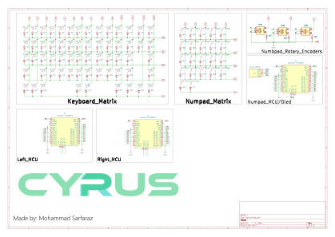

<div align="center">

# Cyprus 

</div>

Cyprus is 60 % mechanical split keyboard designed by Mohammad Sarfaraz aka Sappling.


## Navigation

* [Assets](./Assets/)
* [Cad file](./Cad/)
* [Firmware](./Firmware/)
* [Production](./Production/)

### Variants

There is just one variant right now. 

`Cyprus HW` : Cyprus Handwired

## BOM 


## Firmware

*⚠️Note: Before you understand firmware, you need to have a basic understanding of [how keyboard matrix work](https://docs.qmk.fm/how_a_matrix_works).*

This project uses [ZMK firmware](https://zmk.dev/docs) to code the board. Visit the link to read the documentation for a lot more information.

I am going to explain basics that you need to understand in the firmware. 

You assign board in file named `build.yaml`

``` 
include: 
  - board: nice_nano_v2
    shield: Cyprus_left
  - board: nice_nano_v2
    shield: Cyprus_right 
  - board: nice_nano_v2
    shield: settings_reset

```
You assign the common rows of the split in `<keyboard_name>.dtsi` file.

```    kscan0: kscan {
        compatible = "zmk,kscan-gpio-matrix";
        wakeup-source;
        diode-direction = "col2row";
        row-gpios = <&pro_micro 4 (GPIO_ACTIVE_HIGH | GPIO_PULL_DOWN)>,
                    <&pro_micro 8 (GPIO_ACTIVE_HIGH | GPIO_PULL_DOWN)>;
    };

```

You assign column in separate .overlay files

``` &kscan0 {
    col-gpios = <&pro_micro 21 GPIO_ACTIVE_HIGH>,
                <&pro_micro 14 GPIO_ACTIVE_HIGH>;
};

```

**Keymap**

 visit https://zmk.dev/docs/keymaps/behaviors

Standard keymap -

``` 
keymap {
        compatible = "zmk,keymap";

        default_layer {
            // -----------------------------------------------------------------------------------------
            // | `   |  1  |  2  |  3  |  4  |  5  |  6  |   |  7  |  8  |  9  |  0  |  -  |  =  | BKSP |
            // | TAB |  Q  |  W  |  E  |  R  |  T  |  Y  |   |  U  |  I  |  O  |  P  |  [  |  ]  |  \   |
            // | CAPS|  A  |  S  |  D  |  F  |  G  |  H  |   |  J  |  K  |  L  |  ;  |  '  | ENT |
            // | SHFT|  Z  |  X  |  C  |  V  |  B  |       |  N  |  M  |  ,  |  .  |  /  | SHFT|
            // | CTRL| GUI | ALT | SPC |             |       | SPC | MO1 | ALT | GUI | CTRL|
            // -----------------------------------------------------------------------------------------
            bindings = <
              &kp GRAVE &kp N1 &kp N2 &kp N3 &kp N4 &kp N5 &kp N6   &kp N7 &kp N8 &kp N9 &kp N0 &kp MINUS &kp EQUAL &kp BSPC
              &kp TAB   &kp Q  &kp W  &kp E  &kp R  &kp T  &kp Y    &kp U  &kp I  &kp O  &kp P  &kp LBKT  &kp RBKT  &kp BSLH
              &kp CLCK  &kp A  &kp S  &kp D  &kp F  &kp G  &kp H    &kp J  &kp K  &kp L  &kp SEMI &kp SQT          &kp RET
              &kp LSHFT &kp Z  &kp X  &kp C  &kp V  &kp B           &kp N  &kp M  &kp COMMA &kp DOT &kp FSLH       &kp RSHFT
              &kp LCTRL &kp LGUI &kp LALT &kp SPACE                 &kp SPACE &mo 1 &kp RALT &kp RGUI &kp RCTRL
            >;
        }; };

```

### Build and Configuration

#### Prerequisites

 *  Basic Soldering skill
 *  Access to 3d Printer

#### Cad 

Print the [stl files](./Production/) using a 3d printer.

#### Wiring 

  First you need to wire everything up just like this schematics here. 

  

  Since I have not build it myself, I cant really show you the irl wiring photo. But if you want to know how to wire these effectively, I recommend you to watch any youtube video related to making handwire keyboard.

#### Compile and Flash

Now, you could follow the official method by zmk if you want to add your own personal touch to the firmware of your keyboard.

If you just want to use the pre-compiled firmware:

1. Connect the MCU of your **Left** half to your computer via USB.
2. Enter bootloader mode (usually by double-tapping the reset button). A new USB mass storage drive (e.g., `NICENANO`) should appear on your computer.
3. Copy the compiled left half `.uf2` file into this drive. The drive will automatically disconnect once the flashing is complete.
4. Repeat the same process for the **Right** half with the right half `.uf2` file.


-------------

If you like my work, follow me on instagram - [@ayysappling](https://www.instagram.com/ayysappling/)

-----------

<div align = "center" > Made with love 💛 by Mohammad Sarfaraz </div>


